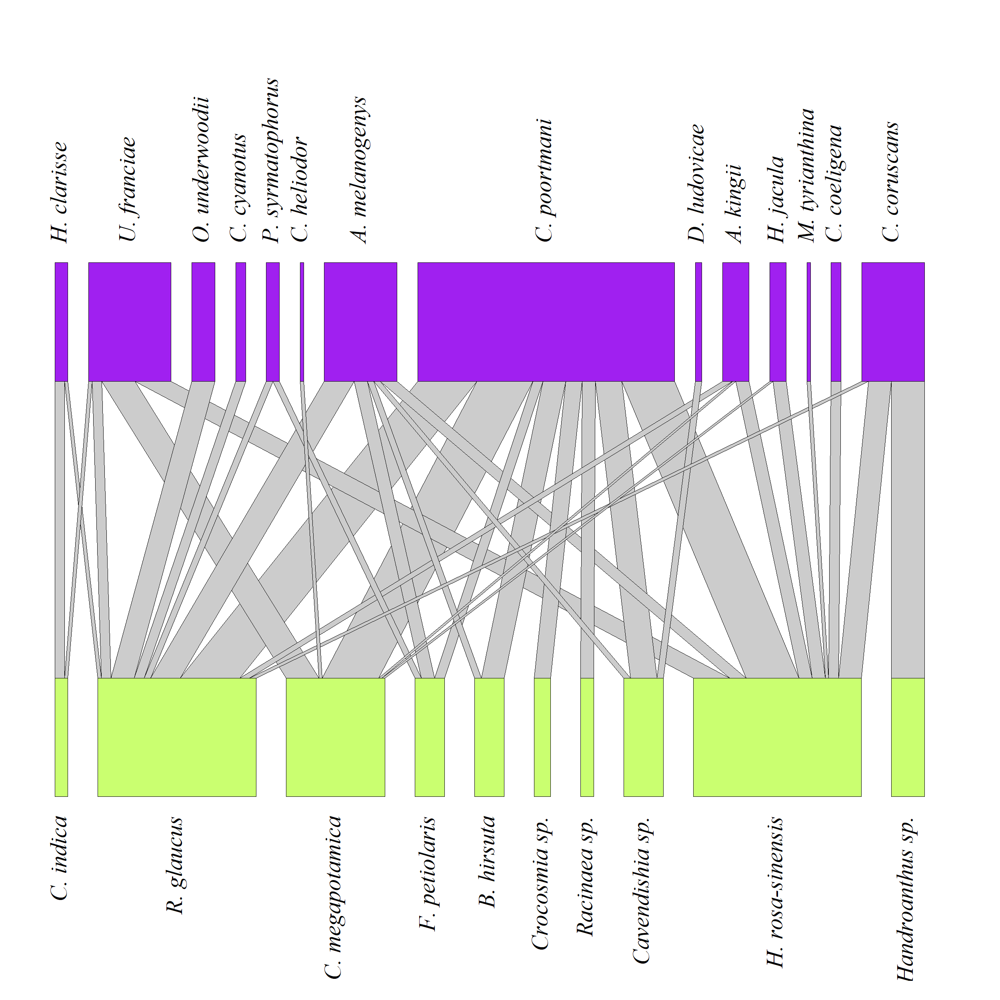
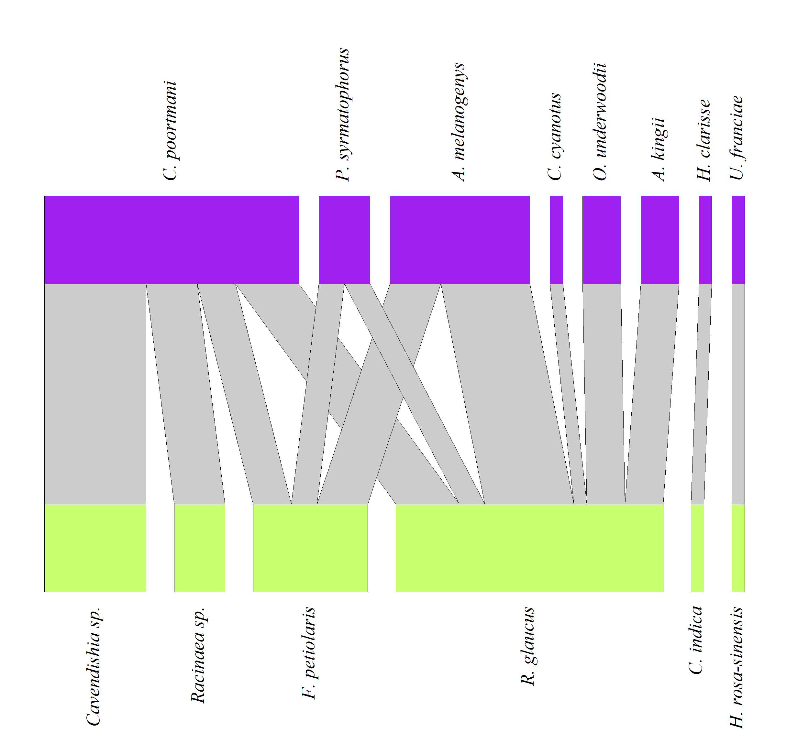
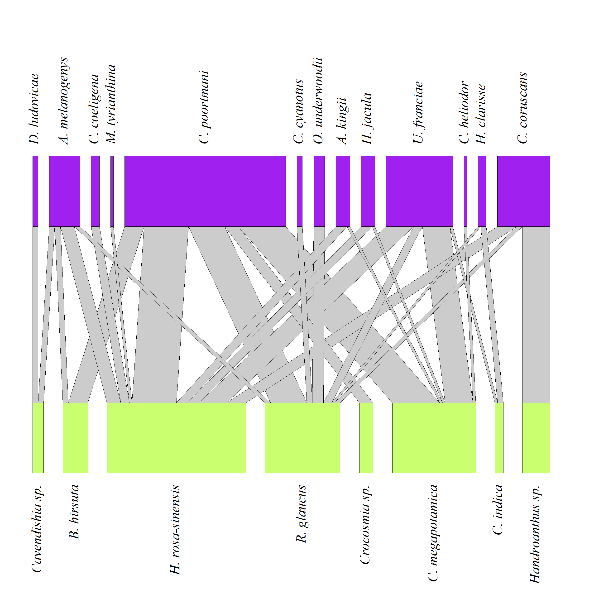
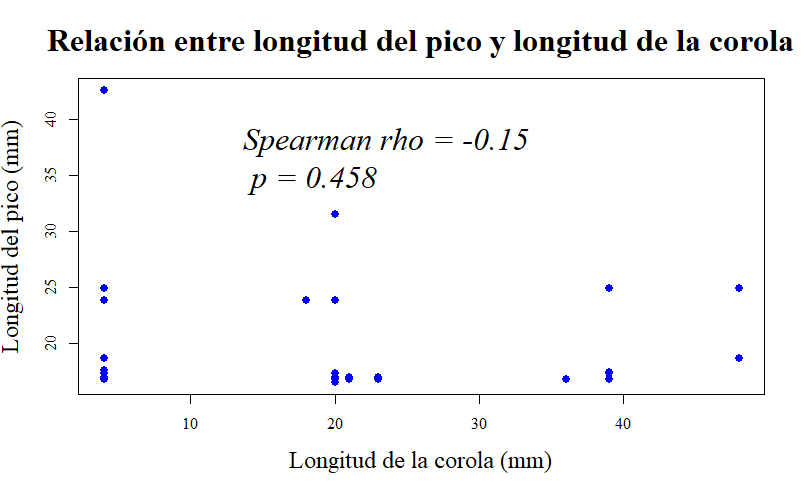

# Ecological Network Analysis of Hummingbird–Plant Interactions

## Overview

This project investigates ecological interaction networks between hummingbirds and flowering plants using field-collected data from Colombia.

The analysis includes bipartite ecological networks, species specialization metrics, seasonal comparisons between rainy and dry periods, and the relationship between hummingbird beak length and flower corolla length using Spearman correlation.

The project was developed as part of an undergraduate Biology research thesis.

## Tools

- R
- bipartite
- vegan
- dplyr
- network

## Methods

- Ecological network analysis
- Species specialization analysis
- Spearman correlation
- Data visualization

## Skills

- Data Analysis
- Statistical Analysis
- Scientific Research
- Research Communication

## Research Objectives

- Analyze hummingbird-plant interaction networks.
- Compare interaction patterns between dry and rainy seasons.
- Evaluate species specialization.
- Assess the relationship between hummingbird beak length and flower corolla length.

## Statistical Methods

- Spearman correlation analysis
- Network-level metrics
- Species-level specialization metrics
- Bipartite ecological network analysis

# Results

### Total Interaction Network

### Rainy Season Interaction Network

### Dry Season Interaction Network

### Beak–Corolla Correlation

